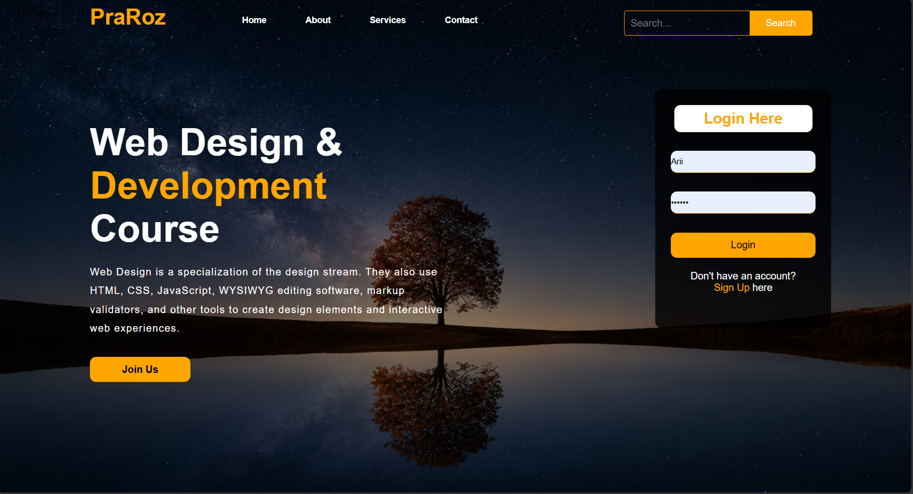

# Course Project

This folder has a simple website made with HTML and CSS.
It is a small practice project with a background image, a navbar area, and a clean layout.

## What is inside

- `index.html` for the page structure
- `style.css` for the design and background image
- `output/1.png` for the preview screenshot

## How to open

Open `index.html` in any browser.
If the page does not show the background, make sure the image file is still inside the `course` folder.

## Preview

